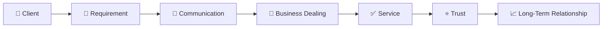
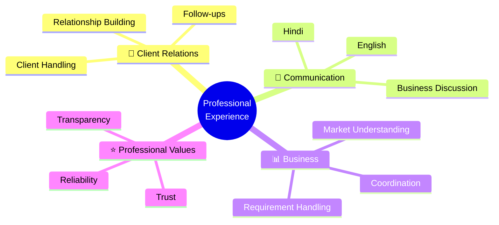

# 👋 Hello, I'm [Your Name]

<p align="center">
  
</p>

<p align="center">
  <strong>💼 Professional Dealer &nbsp;|&nbsp; 🤝 Client Relations &nbsp;|&nbsp; 📈 6+ Years Experience</strong>
</p>

<p align="center">
  
</p>

---

## 👨‍💼 Professional Introduction

I am a **professional dealer with 6+ years of experience**, focused on client dealing, business communication, requirement handling, market understanding, and professional relationship management.

My experience has taught me the importance of **clear communication, understanding client requirements, reliable coordination, and maintaining long-term professional relationships**.

I believe that good business is built not only through successful deals, but through **trust, transparency, consistency, and professional service**.

---

## 📌 At a Glance

<table>
<tr>
<td align="center" width="25%">

### 💼

**6+ Years**

Professional Experience

</td>
<td align="center" width="25%">

### 🤝

**Client Focused**

Relationship Management

</td>
<td align="center" width="25%">

### 💬

**2 Languages**

English & Hindi

</td>
<td align="center" width="25%">

### 📈

**Long Term**

Business Relationships

</td>
</tr>
</table>

---

## 🚀 What I Do



My work revolves around understanding what the client needs, communicating clearly, coordinating professionally, and maintaining a reliable relationship.

---

## 💼 Areas of Experience

### 🤝 Client Relationship Management

* Understanding client requirements
* Maintaining professional communication
* Managing client follow-ups
* Building long-term relationships

### 💬 Business Communication

* Professional client communication
* English & Hindi communication
* Business discussions
* Requirement clarification

### 📊 Business & Market Understanding

* Understanding market requirements
* Client requirement analysis
* Business coordination
* Professional dealing

### 🎯 Professional Service

* Clear communication
* Transparent discussions
* Reliable coordination
* Client-focused approach

---

## 🧩 Professional Strengths



---

## 📈 Experience

| Professional Area            |    Experience   |
| :--------------------------- | :-------------: |
| 💼 Dealer / Business Dealing |   **6+ Years**  |
| 🤝 Client Handling           |   **6+ Years**  |
| 💬 Client Communication      | **Experienced** |
| 🎯 Requirement Handling      | **Experienced** |
| 📊 Market Understanding      | **Experienced** |
| 🔄 Business Coordination     | **Experienced** |
| ⭐ Relationship Management    | **Experienced** |

---

## 🔄 My Professional Process

```text
┌──────────────────────────┐
│       👤 CLIENT          │
│     Requirement          │
└────────────┬─────────────┘
             │
             ▼
┌──────────────────────────┐
│      🎯 UNDERSTAND       │
│   Identify the Need      │
└────────────┬─────────────┘
             │
             ▼
┌──────────────────────────┐
│      💬 COMMUNICATE      │
│    Clear Discussion      │
└────────────┬─────────────┘
             │
             ▼
┌──────────────────────────┐
│       🤝 DEAL            │
│ Professional Coordination│
└────────────┬─────────────┘
             │
             ▼
┌──────────────────────────┐
│       ✅ DELIVER         │
│     Reliable Service     │
└────────────┬─────────────┘
             │
             ▼
┌──────────────────────────┐
│       ⭐ TRUST           │
│  Long-Term Relationship  │
└──────────────────────────┘
```

---

## 🌐 Languages

<p align="center">

|    Language    |  Proficiency |
| :------------: | :----------: |
| 🇮🇳 **Hindi** |    Fluent    |
| 🌎 **English** | Professional |

</p>

---

## 🎯 What Matters to Me

<table>
<tr>
<td>🤝 <b>Trust</b><br>Building dependable professional relationships.</td>
<td>💬 <b>Communication</b><br>Keeping discussions clear and professional.</td>
</tr>
<tr>
<td>✅ <b>Reliability</b><br>Maintaining consistent and dependable service.</td>
<td>📈 <b>Growth</b><br>Building relationships that create long-term value.</td>
</tr>
</table>

---

## 💡 Professional Philosophy

> **"Understand the requirement. Communicate clearly. Work professionally. Build lasting trust."**

I believe every client interaction is an opportunity to create a positive professional experience and build a relationship based on **trust, transparency, and mutual value**.

---

## 🤝 Let's Connect

I am open to **business discussions, professional collaborations, client requirements, and new opportunities**.

<p align="center">

<a href="mailto:[Your Email]">
  
</a>

<a href="[Your LinkedIn]">
  
</a>

<a href="[Your Website]">
  
</a>

</p>

---

<p align="center">
  <i>Thank you for visiting my profile.</i>
  <br><br>
  <strong>Trust • Communication • Professionalism • Growth</strong>
</p>

<p align="center">
  
</p>
