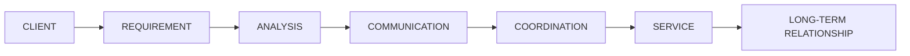
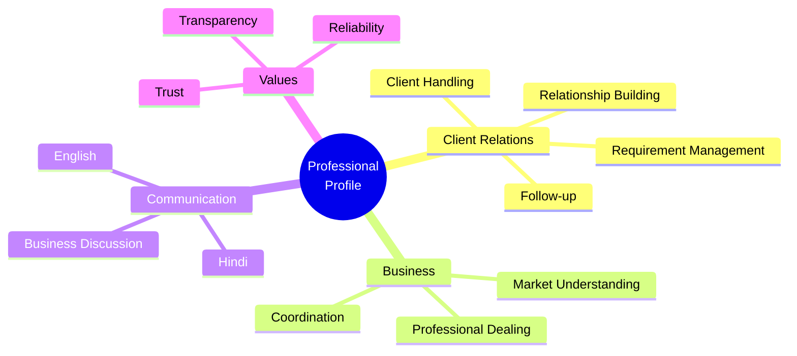

# HRITHIK ROHIN

### Professional Dealer · Client Relations · Business Development

  

  <strong>6+ Years of Professional Experience</strong>
   
  Client Management · Business Communication · Relationship Management

---

## Professional Summary

I am a **professional dealer with 6+ years of experience** in client dealing, business communication, requirement management, market understanding, and professional relationship building.

Throughout my experience, I have worked closely with clients to understand their requirements, coordinate business discussions, maintain clear communication, and support long-term professional relationships.

My working philosophy is straightforward:

> **Understand the requirement → Communicate clearly → Deliver professionally → Build lasting trust.**

---

## Experience

### 6+ Years in Professional Client & Business Dealing

My experience covers the complete client relationship process — from understanding initial requirements to maintaining professional communication and long-term coordination.

| Area                    | Experience   |
| ----------------------- | ------------ |
| Client Dealing          | 6+ Years     |
| Business Relations      | 6+ Years     |
| Client Communication    | Professional |
| Requirement Handling    | Experienced  |
| Market Understanding    | Experienced  |
| Business Coordination   | Experienced  |
| Relationship Management | Experienced  |

---

## Professional Workflow

This approach helps keep client requirements clear, communication organized, and business relationships professional.

---

## Core Areas

<table>
<tr>
<td width="50%">

### Client Relations

* Client handling
* Requirement understanding
* Professional follow-ups
* Relationship management
* Long-term coordination

</td>

<td width="50%">

### Business Communication

* Client communication
* Business discussions
* Requirement clarification
* English communication
* Hindi communication

</td>
</tr>

<tr>
<td>

### Business Understanding

* Market requirements
* Client needs
* Business coordination
* Professional dealing
* Requirement management

</td>

<td>

### Professional Values

* Trust
* Transparency
* Reliability
* Clear communication
* Consistent service

</td>
</tr>
</table>

---

## Professional Strengths

---

## Languages

| Language    | Proficiency                |
| :---------- | :------------------------- |
| **Hindi**   | Fluent                     |
| **English** | Professional Communication |

---

## Professional Approach

I focus on creating a professional experience at every stage of client interaction.

**01 — Understand**
Understand the client's requirement clearly.

**02 — Communicate**
Keep all discussions clear, direct, and professional.

**03 — Coordinate**
Manage communication and business coordination efficiently.

**04 — Deliver**
Focus on reliable and professional service.

**05 — Build**
Maintain relationships based on trust and long-term value.

---

## What I Value

### Trust

Strong professional relationships start with trust and transparency.

### Communication

Clear communication helps avoid misunderstandings and creates better business relationships.

### Reliability

Consistent communication and dependable coordination are important parts of professional service.

### Long-Term Relationships

I focus on building relationships that can continue and grow beyond a single business transaction.

---

## Let's Connect

I am open to **business discussions, professional collaborations, client requirements, and new opportunities**.

&nbsp;

&nbsp;

---

**Thank you for visiting my profile.**

 

Professionalism · Trust · Communication · Long-Term Relationships

  

