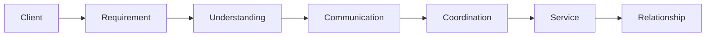
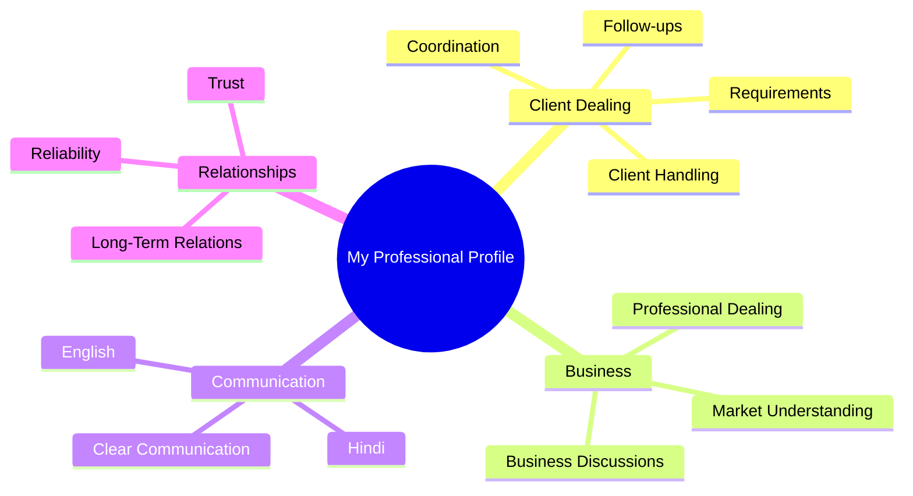

# HRITHIK ROHIN

### Professional Dealer | Client Relations | Business Development

  

  <b>6+ Years of Professional Experience</b>
   
  Client Dealing · Business Communication · Relationship Management

---

## About Me

Hello, I'm **Hrithik Rohin**.

I have **6+ years of professional experience** in client dealing, business communication, requirement handling, and relationship management.

Over the years, I have worked with different client requirements and business discussions. My focus has always been to understand the requirement properly, communicate clearly, coordinate everything professionally, and maintain a good working relationship.

For me, professional dealing is simple:

> **Understand the requirement → Communicate clearly → Do the work properly → Maintain the relationship.**

---

## My Experience

### 6+ Years of Client & Business Dealing

My experience mainly involves working directly with clients and handling different stages of business communication.

| Area                    | Experience  |
| :---------------------- | :---------- |
| Client Dealing          | 6+ Years    |
| Business Communication  | 6+ Years    |
| Client Relations        | 6+ Years    |
| Requirement Handling    | Experienced |
| Business Coordination   | Experienced |
| Market Understanding    | Experienced |
| Follow-ups              | Experienced |
| Relationship Management | Experienced |

---

## How I Work

I prefer keeping things simple and clear. First I understand what the client needs, then I communicate properly, coordinate the work, and maintain the relationship.

---

## What I Do

<table>
<tr>
<td width="50%">

### Client Relations

* Client dealing
* Requirement understanding
* Regular follow-ups
* Client coordination
* Relationship management

</td>

<td width="50%">

### Communication

* Business discussions
* Requirement clarification
* Client communication
* Professional English
* Hindi communication

</td>
</tr>

<tr>
<td>

### Business

* Market understanding
* Client requirements
* Business coordination
* Professional dealing
* Service coordination

</td>

<td>

### Work Values

* Trust
* Clear communication
* Transparency
* Reliability
* Professional behaviour

</td>
</tr>
</table>

---

## My Strengths

---

## Languages

| Language    | Level                      |
| :---------- | :------------------------- |
| **Hindi**   | Fluent                     |
| **English** | Professional Communication |

---

## My Approach

**01. Understand**

I first try to understand the client's actual requirement.

**02. Communicate**

I keep communication simple, clear, and professional.

**03. Coordinate**

I make sure the required communication and follow-ups are properly handled.

**04. Deliver**

I focus on providing reliable and professional service.

**05. Maintain**

I believe a good business relationship should continue even after the initial discussion or transaction.

---

## What Matters to Me

### Trust

I believe trust is important in any professional relationship.

### Clear Communication

Good communication makes business discussions easier and avoids unnecessary confusion.

### Reliability

Being available, responding properly, and keeping communication consistent are important to me.

### Long-Term Relationships

I prefer building professional relationships that can continue for the long term.

---

## Let's Connect

If you would like to discuss **business, client requirements, professional collaboration, or new opportunities**, feel free to contact me.

---

**Thank you for visiting my profile.**

 

Professionalism · Trust · Communication · Reliability

  

